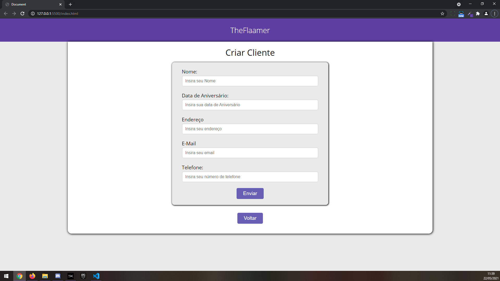
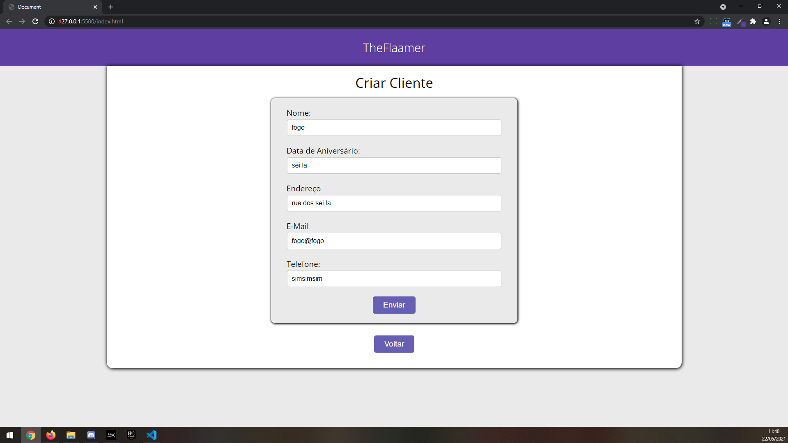
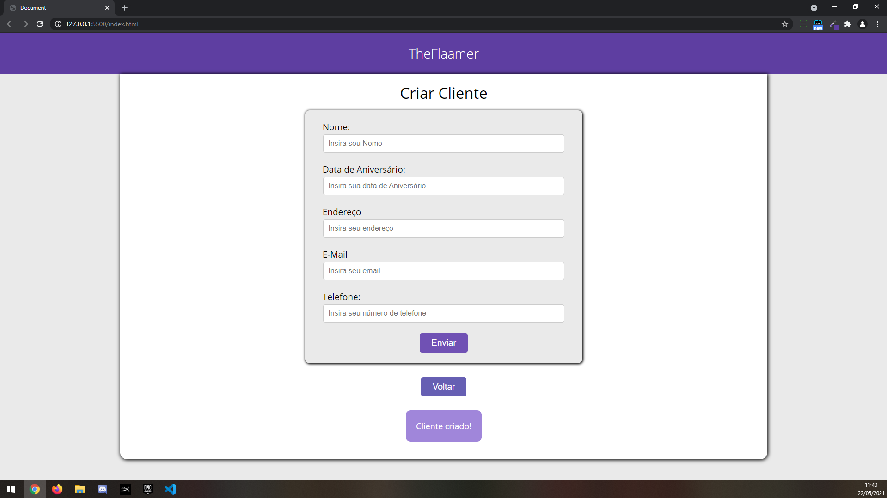
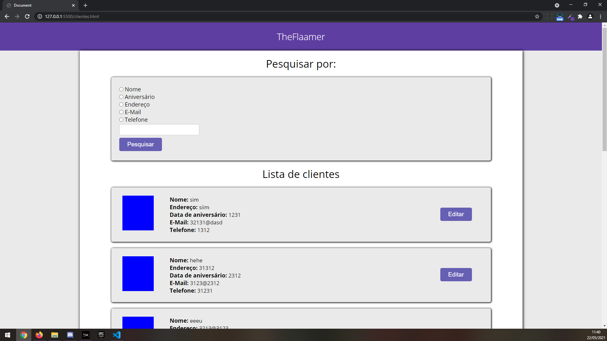
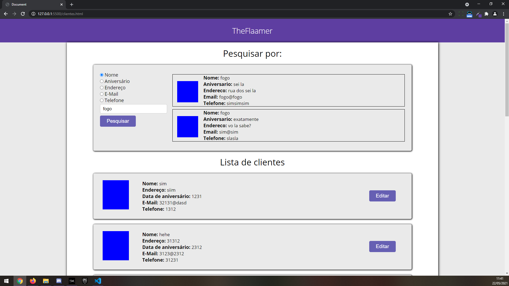

<h1>Criar Cliente</h1>

Projeto feito com o objetivo do treino e aprendizado das técnicas de Orientação a Objetos e ao armazenamento local (localStorage).

<h2>Técnologias Utilizadas</h2>
<ul>
    <li>Java Script</li>
    <li>HTML 5</li>
    <li>CSS 3</li>
</ul>
<h2>Imagens:</h2>
<figure>
	
	<figcaption>Representa a tela inicial do sistema!</figcaption>
</figure>
<figure>
	
	<figcaption>Adicionando elementos no localStorage</figcaption>
</figure>
<figure>
	
	<figcaption>Elementos enviados!</figcaption>
</figure>
<figure>
	
	<figcaption>Representa a tela secundaria do sistema, aba de pesquisas!</figcaption>
</figure>
<figure>
	
	<figcaption>Pesquisando por determinados atributos!</figcaption>
</figure>
<h2>É isso :D</h2>